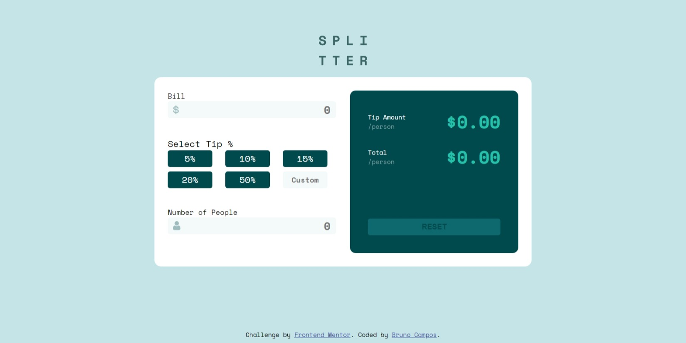
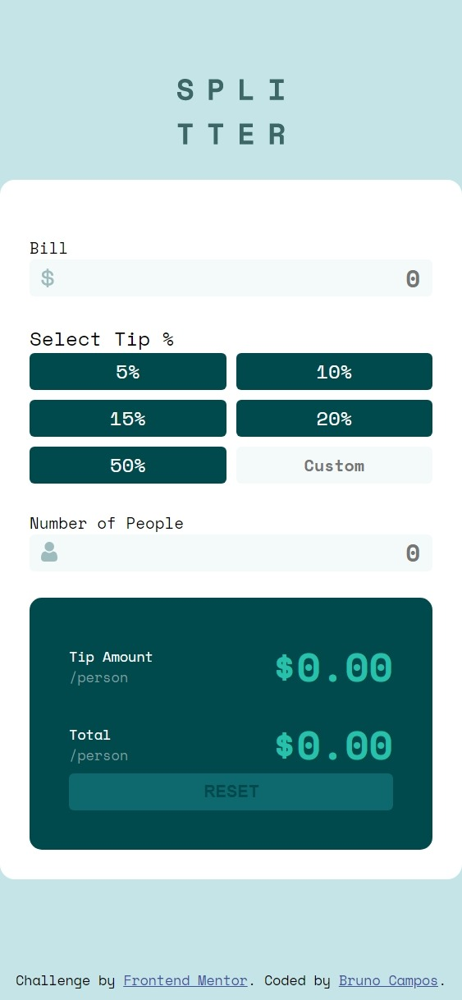

# Frontend Mentor - Tip calculator app solution

This is a solution to the [Tip calculator app challenge on Frontend Mentor](https://www.frontendmentor.io/challenges/tip-calculator-app-ugJNGbJUX). Frontend Mentor challenges help you improve your coding skills by building realistic projects.

## Table of contents

- [Overview](#overview)
  - [The challenge](#the-challenge)
  - [Screenshot](#screenshot)
  - [Links](#links)
- [My process](#my-process)
  - [Built with](#built-with)
- [Author](#author)

## Overview

### The challenge

Users should be able to:

- View the optimal layout for the app depending on their device's screen size
- See hover states for all interactive elements on the page
- Calculate the correct tip and total cost of the bill per person

### Screenshot




### Links

- Solution URL: [Solution](https://www.frontendmentor.io/solutions/pure-html-css-js-site-for-calculate-tips-jvzPmillL)
- Live Site URL: [Live Site](https://brunofow-tip.netlify.app/)

## My process

### Built with

- Semantic HTML5 markup
- CSS custom properties
- Flexbox
- CSS Grid

### What I learned

I really enjoyed learning and using the `toLocaleString` function, it helps a lot to format numbers, dates, etc ...
In this case, I'm using this function to format the calculated bill and tip for a currency model.

```js
total.innerHTML = totalBill.toLocaleString("en-US", {
    style: "currency",
    currency: "USD",
  });
```

## Author

- Frontend Mentor - [@brunofow](https://www.frontendmentor.io/profile/brunofow)
- Linkedin - [Bruno Campos](https://www.linkedin.com/in/brunofow/)

